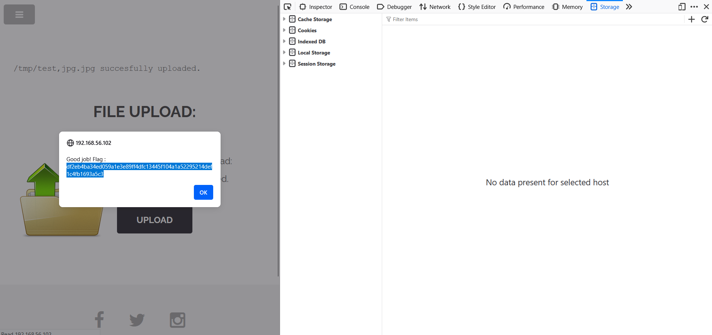

# Cookie Tampering - I_am_admin

## Why is it dangerous ?
Here, we modified the value of the cookie session. This is dangerous because if an attacker try to bruteforce the cookie session value, and succeed to find the eral value of another cookie, he will be able to access the account of someone else. Depending on the session, he can impersonate a session or obtain higher privileges if the session is from an admin account. Everyone having a specific cookie can act at the name of this specific user, without being truly the user.

## 1 - How to get the flag ?
1. Open the developer tools in web browser with CTRL + SHIFT + I
2. Go to the `Storage` section
3. On the left sidebar, open the `cookies` section
4. Click on `http://DarklyIPaddress`
5. On the item tabs, there is 'Name' and `Value` row
	You can see that 'Name' row has `I_am_admin` as name -> meaning it might be the name of the admin
6. Recover the content of `Value` cell. This is a hash string. Once you decrypt it with the [hash cracker tool](https://crackstation.net/), you will see that it is encrypted with MD5 algorithm and the content is `false`.
7. Then, replace this encrypted content by the hashed string `true` with the same MD5 encryption method using the [MD5 encryptor tool](https://www.md5hashgenerator.com/). It should give you: `b326b5062b2f0e69046810717534cb09`
8. Paste `b326b5062b2f0e69046810717534cb09` into the `Value` cell. 
9. Reload the page.

## 2 - Result

You should be redirected on the page that contains the flag.

  

## How to prevent it ?

- Always verify on the server-side the value given by the client. Everything that is client-side can be modified by the client itself and can not be accurate.
- Correctly configure the cookie attribution. 
	- Use: `HttpOnly` in order to block the modification with JS. This prevent the access by document.cookie
	- Use `Lax` or 'Strict' for the SameSite parameter to reduce CSRF attack or data leaks.
- Use a strong tool to encrypt the cookie session
- Make short session cookies, like 16hours max, and rotate it if needed.
- Reenforce security connexion with 2FA
- Log abnormal attempts and create alerts
- If the server detects an abnormal situation, ask the user to re-authenticate

## References:
[Session_Management_Cheat_Sheet](https://cheatsheetseries.owasp.org/cheatsheets/Session_Management_Cheat_Sheet.html#cookies)

[Cookie_Theft_Mitigation_Cheat_Sheet](https://cheatsheetseries.owasp.org/cheatsheets/Cookie_Theft_Mitigation_Cheat_Sheet.html)