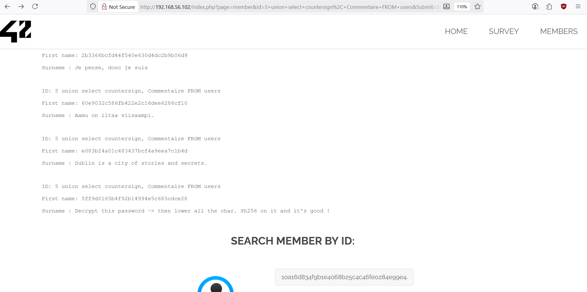

# UNION-based SQL Injection - Search Member by ID

## Why is it dangerous ?
This let the attacker execute random query in the database. He can then read/write/modify/erase data in the database. If the attacker can execute it with an admin privilege, then the impact is fully damageable — potential takeover of application storage or even the server

## 1 - How to get the flag ?

Let's do basically the same as Flag04 but for Search Member by ID section
1. In the homepage, click on Member button located in the header
	- By searching: 1, then 2, then ... until 5 -> you get an indication that the flag can be hidden in the number 5 member ID
2. In the input box, write `5 union select user(), database()`, then press submit button. By doing this you want to get the info of the database, to know how it is structured
	- it can be potentially SQL injected. Let's dive deeper to know it
Then you can also see that the Surname is `Member_Sql_Injection` for member ID 5. This will help us for the future.
3. In the input box, write `5 union select table_name, table_schema FROM information_schema.tables`
	- WHY this input ? This is written in the PHP manual
	- It will give all the information about how are structured the tables in the database
		- look for `Member_Sql_Injection` section
	- It gives you another information which is the First Name called `users`
4. Now we want to know how is specific users table is structured:
	- In the input box, write `5 union select COLUMN_NAME, table_name FROM information_schema.columns`
	- It will give you how every `COLUMN_NAME` are structured 
	- Find the users one, because this is the one that interests us
	You can see that it is divided in 8 parts: `user_id`, `first_name`, `last_name`, `town`, `country`, `planet`, `Commentaire`, `countersign`
5. Then try to look for the information for each component of users. For example, in the input box, write `5 union select countersign, Commentaire FROM users`.
	- then read all the info and you should get the flag.

## 2 - Result

You should be able to read this to get the flag.

  

> [!NOTE]
> the flag is `10a16d834f9b1e4068b25c4c46fe0284e99e44dceaf08098fc83925ba6310ff5`

## How to prevent it ?

- parameterized queries. 
- Validate and standardize input

## References:
[examining-the-database](https://portswigger.net/web-security/sql-injection/examining-the-database)

[union-based-injection](https://hackviser.com/tactics/pentesting/web/sql-injection#union-based-injection)

[SQL_Injection_Prevention_Cheat_Sheet](https://cheatsheetseries.owasp.org/cheatsheets/SQL_Injection_Prevention_Cheat_Sheet.html)