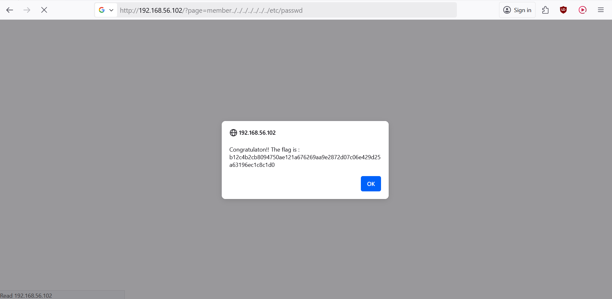

# Directory Traversal - URL Route http://darklyIPaddress/../../

## Why is it dangerous ?

You can exit the webroot directory and then access to sensitives files like `/etc/passwd`. This let the attacker reveal passwords. But for others cases, the attacker could get access to any other files, like pictures, or admin files, ... 

## 1 - How to get the flag ?

1. If you check the URL and try to get back in the previous project folder, by writing: `http://darklyIPadress/../` you will see that there is an indication with a certain message
2. Then do it again until getting a clearer indication like 'you can do it' -> you have to input until `http://darklyIPadress/?page=member../../../../../../../`
3. Then we can suppose that we are in a Linux environment and try to look for the password file. It is located in /etc folder. Meaning try: `http://darklyIPadress/?page=member../../../../../../../etc/passwd`
4. Then a popup alert should give the explicit flag for you

## 2 - Result

You should be redirected on the page that contains the flag.

  

## How to prevent it ?

- Don’t store sensitive configuration files inside the web root
- Never include path controlled by the user. For exemple, if you want to access this file `/var/www/pages/member_5`.php'for your web, use intern id like `?page=member&id=5` to let the server know which page you want to access.
- Only puclicly grant access to certain files. Whitelist the most useful file and restrain the one that are private.
- Validate the user input before processing it. Ideally, compare the user input with a whitelist of permitted values. If that isn't possible, verify that the input contains only permitted content, such as alphanumeric characters only.
- After validating the supplied input, append the input to the base directory and use a platform filesystem API to canonicalize the path. Verify that the canonicalized path starts with the expected base directory.

## References:
[Path_Traversal](https://owasp.org/www-community/attacks/Path_Traversal)

[file-path-traversal](https://portswigger.net/web-security/file-path-traversal)

[01-Testing_Directory_Traversal_File_Include](https://owasp.org/www-project-web-security-testing-guide/latest/4-Web_Application_Security_Testing/05-Authorization_Testing/01-Testing_Directory_Traversal_File_Include)
