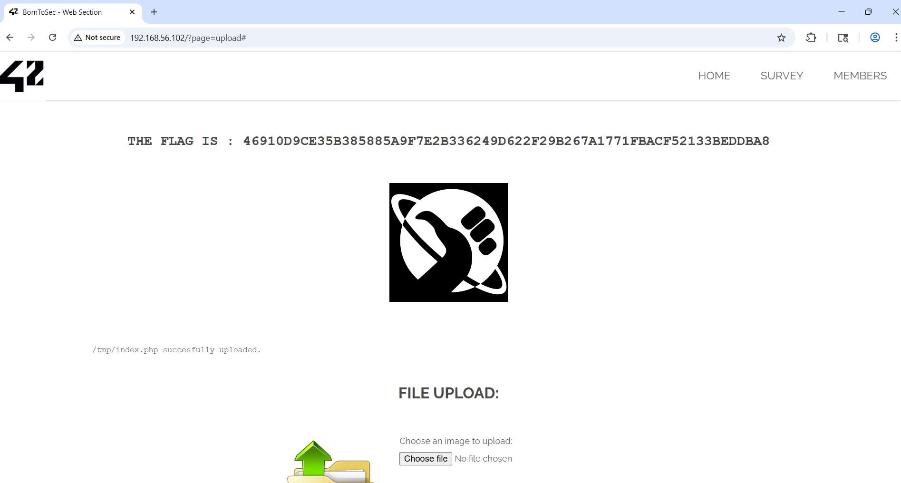

# Unrestricted file upload - Submit Image with php code integrated

## Why is it dangerous ?

An uploaded file not well filtered can contain malicious code and if the server execute it, this lead to a Remote Code Execution (RCE).
The web server can be compromised by uploading and executing a web-shell which can run commands, browse system files, browse local resources, attack other servers, or exploit the local vulnerabilities, and so forth.
The file storage server might be abused to host troublesome files including malwares, illegal software, or adult contents. Uploaded files might also contain malwares’ command and control data, violence and harassment messages, or steganographic data that can be used by criminal organisations.

## How to find the flag ?

### Launch Burp and its integrated browser

1. Open **Burp Suite**
   - Select **Temporary project in memory**
   - Click **Next**
   - Choose **Use Burp defaults**
   - Click **Start Burp**

2. Configure the Proxy
   - Navigate to **Proxy → Intercept**
   - Make sure **Intercept is on** (the button should display "Intercept on")

3. Launch the integrated browser
   - Click **Open Browser** (button in the Proxy tab)
   - This launches the built-in browser, which is already configured to use Burp as a proxy

### Load the target page

4. In the built-in browser, paste the vulnerable URL:
   ```
   http://DarklyIPaddress/?page=upload
   ```
	Press **Enter** in the default web browser to make it load.
	Alternatively, you can click on the **Add Image** button from the homepage.

5. The page should load indefinitely - this is a good sign

### Go back to Burp Suite

6. The request will arrive in **Proxy → Intercept → Request** and will be blocked (intercepted). Now you have to click on **Forward**.
After clicking on **Forward**, you should see this:
<p align="center">
  
</p>

### Create the script

7. Create any php script. Make sure you save it as a php file. This won't work if it's a text file.
```
<?php
echo "Hello World";
?>
```
You can see the index.php file created for this purpose in the folder.

8. Upload the script into the darkly website in the Burp Suite web browser. Click on **Upload** button.

### Change HTTP request in Burp Suite

9. Go back to Burp Suite. In the **Proxy** panel, you have a **Request** window. Inside of this window, you will change: `Content-Type: application/octet-stream` into `Content-Type: image/jpg`
After modifying the HTTP request, you should have this piece of code:
<p align="center">
  
</p>

10. Press **forward** button.

## Result

You should see the page that contains the flag.
<p align="center">
  
</p>

## How to prevent it ?

- Never trust what the client is sending. Always verify on the server-side what has been sent. 
- Never trust the header of a uploaded file sent by the client.
- If the server is waiting for an image to be uploaded, you can use server libraries to re-encode the image. In that way, you are sure that the file sent is strictly the category file that you want.
- Store the files sent by the client outside the webroot and deactivate any execution mode. Just grant the rw (Read+Write) permissions.
- Rename the file (with UUID for example) sent by the client and force the extension wanted by the server. Avoid as well double extensions (like shell.php.jpg).
- Before the file exposure, store it in a clustered environment, like a sandbox.
- Block any executable extensions like .php, .exe, .sh, ... and refuse any suspicious file. Verify also the SVG file because they can contain JS code.
- Set a file size limit

## References:
[File_Upload_Cheat_Sheet](https://cheatsheetseries.owasp.org/cheatsheets/File_Upload_Cheat_Sheet.html)

[file-upload](https://portswigger.net/web-security/file-upload)

[Unrestricted_File_Upload](https://owasp.org/www-community/vulnerabilities/Unrestricted_File_Upload)
