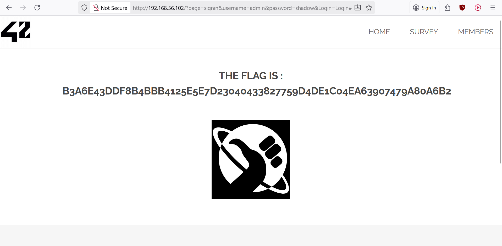

# BruteForce - Login page

## Why is it dangerous ?

If you can bruteforce a login page or a URL to find special files, then you let the attacker having access to more data than usual data needed by a random user. Which can be a default of protection.<br>
Then if a website let the bruteforce being possible, he will be able to try any kind of login and password until he gets access to someone else's account. More critical, the attack can be targeted on a specific user, then with a string password's dictionnary, the attacker can try many passwords until he gets the access. That's why as a user, it is very important to use not common password, but a strong and complex one.<br>
Although brute-force attacks are difficult to stop completely, they are easy to detect because each failed login attempt records an HTTP 401 status code in your Web server logs. It is important to monitor your logfiles for brute-force attacks – particularly, the intermingled 200 statuscodes that mean the attacker found a valid password.

## How to get the flag ?

### Launch Burp and its integrated browser

1. Open **Burp Suite**
   - Select **Temporary project in memory**
   - Click **Next**
   - Choose **Use Burp defaults**
   - Click **Start Burp**

2. Configure the Proxy
   - Navigate to **Proxy → Intercept**
   - Make sure **Intercept is on** (the button should display "Intercept on")

3. Launch the integrated browser
   - Click **Open Browser** (button in the Proxy tab)
   - This launches the built-in browser, which is already configured to use Burp as a proxy

### Load the target page

4. In the built-in browser, paste the vulnerable URL:
   ```
   http://DarklyIPaddress/?page=signin
   ```
	Press **Enter** in the default web browser to make it load.
	Alternatively, you can click on the **Sign In** button from the homepage.

5. The page should load indefinitely - this is a good sign

### Go back to Burp Suite

6. The request will arrive in **Proxy → Intercept → Request** and will be blocked (intercepted). Now you have to click on **Forward**.<br>
After clicking on **Forward**, you should see this:
<p align="center">
  
</p>

###

7. In the login input, write `admin` and in the password input, write a random password like `123456` and click in **Login** button.

8. Then go back to Burp Suite. In **Proxy**, riglt click on `GET` method amd click on **Send to intruder**.
Like this:
<p align="center">
  
</p>

9. Then **Intruder** panel. Inside the main box, you have in the first line the GET http request with the login that you put and the password. Double click on the password `123456` to select it entirely and click on **Add §** button.<br>
After modifying it, you should see this:
<p align="center">
  
</p>

10. In **Intruder → Payloads → Payload configuration** at the right, click on **Load** button to let Burp load the **rockyou.txt** dictionnary. Above, make Sure **Payload type** is set with **Simple List**.
<p align="center">
  
</p>

11. Now, at the very right, in **Intruder → Settings**, go to **Auto-pause attack** section, you have to add: `win.png`. Why win.png ? Because we know that each time we found a flag (or most of the time), it goes with the image named win.png.
<p align="center">
  
</p>
It should Enable **auto-pause** as well. Just , in match type, select **Simple string**.
<p align="center">
  
</p>

12. Do the same in the box just below called **Grep - Match**. Add `win.png`. It should appear at the bottom of the list.
<p align="center">
  
</p>

13. Now in **Intruder**, you can start the attack by clicking on **Start attack**, with **Sniper Attack** mode.

## Result

You should be redirected on the page that contains the flag.
<p align="center">
  
</p>

## How to prevent it ? 

- You can use denfensive tools like: Php-Brute-Force-Attack Detector
- Try to block any IP that has done multiple failed requests under a certain amuont of time. For example, if an attacker try to bruteforce the login page, block after 10 requests under 2 minutes
- Use delay of 2 seconds between each loging in if the password is incorrect.
- Add security measure for login like 2FA, security question, or a code received in the username mailbox to input.
- Use a CAPTCHA to prevent automated attacks
- Assign unique login URLs to blocks of users so that not all users can access the site from the same URL.

## References:
[Brute_force_attack](https://owasp.org/www-community/attacks/Brute_force_attack)
