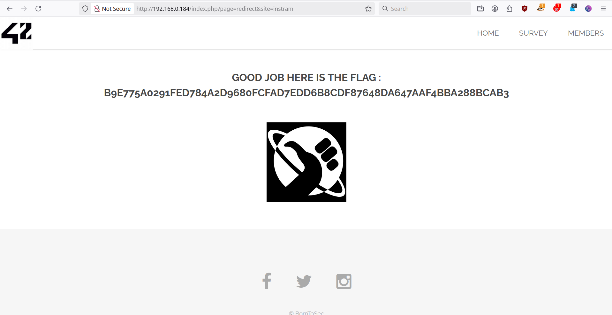

# Open Redirect - Check Homepage source Code

## Why is it dangerous ?

It is important to protect it because an attacker can trick users into visiting malicious sites using a link that seems to belong to your domain.

Attackers often use this trick to:

- Bypass spam filters or security scanners (since the link "starts" with a trusted domain)
- Steal user sessions or credentials
- Launch phishing attacks with legitimate-looking URLs
- The user may be redirected to an untrusted page that contains malware which may then compromise the user's system. In some cases, an open redirect can also enable the immediate download of a file without the user's permission
<br>
Example on why it is bad:

    <a href="http://bank.example.com/redirect?url=http://attacker.example.net">Click here to log in</a>
The user may assume that the link is safe since the URL starts with their trusted bank, bank.example.com. However, the user will then be redirected to the attacker's web site (attacker.example.net) which the attacker may have made to appear very similar to bank.example.com. The user may then unwittingly enter credentials into the attacker's web page and compromise their bank account. A Java servlet should never redirect a user to a URL without verifying that the redirect address is a trusted site.

## 1 - Check Homepage source Code
1. In the homepage, open the devTool with Control + Shift + I. Go at the bottom of the page and select one of the three social media icon. The code is written like this:
```
	<li><a href="index.php?page=redirect&site=facebook" class="icon fa-facebook"></a></li>
	<li><a href="index.php?page=redirect&site=twitter" class="icon fa-twitter"></a></li>
	<li><a href="index.php?page=redirect&site=instagram" class="icon fa-instagram"></a></li>
```

2. Change the redirection of one of the links after 'site='. For example: `index.php?page=redirect&site=whatever`

## 2 - Result

You should be redirected on the page that contains the flag.
<p align="center">
  
</p>
---

## How to prevent it ? 

- Simply avoid to use redirects and forwards
- If used, do not allow the URL as user input for the destination.
- Where possible, have the user provide short name, ID or token which is mapped server-side to a full target URL.
	- This provides the highest degree of protection against the attack tampering with the URL.
	- Be careful that this doesn't introduce an enumeration vulnerability where a user could cycle through IDs to find all possible redirect targets
- If user input can’t be avoided, ensure that the supplied value is valid, appropriate for the application, and is authorized for the user.
- Sanitize input by creating a list of trusted URLs (lists of hosts or a regex).
	-This should be based on an allow-list approach, rather than a denylist.
- Force all redirects to first go through a page notifying users that they are going off of your site, with the destination clearly displayed, and have them click a link to confirm.

## References:
[Testing_for_Client_Side_URL_Redirect](https://owasp.org/www-project-web-security-testing-guide/v41/4-Web_Application_Security_Testing/Client_Side_Testing/04-Testing_for_Client_Side_URL_Redirect)

[Unvalidated_Redirects_and_Forwards_Cheat_Sheet](https://cheatsheetseries.owasp.org/cheatsheets/Unvalidated_Redirects_and_Forwards_Cheat_Sheet.html)

[URL Redirection to Untrusted Site ('Open Redirect')](https://cwe.mitre.org/data/definitions/601.html)