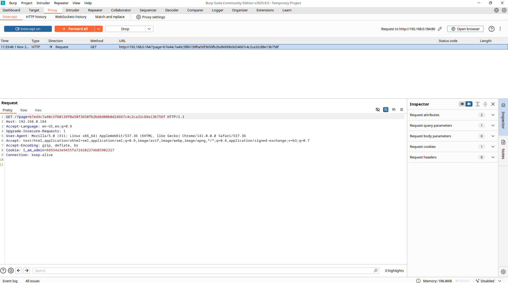
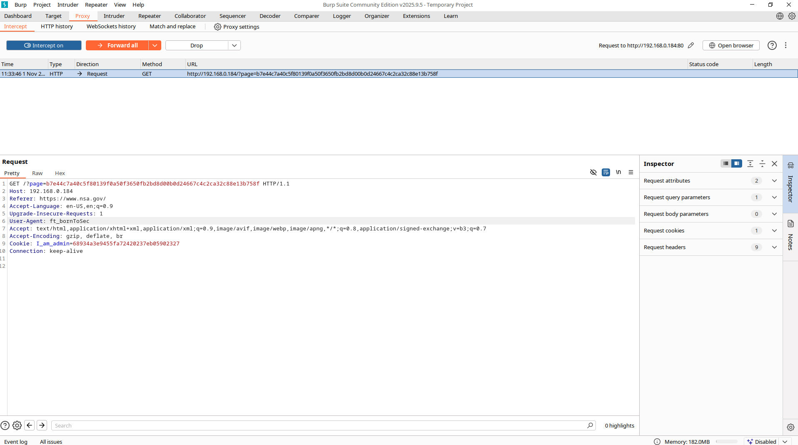
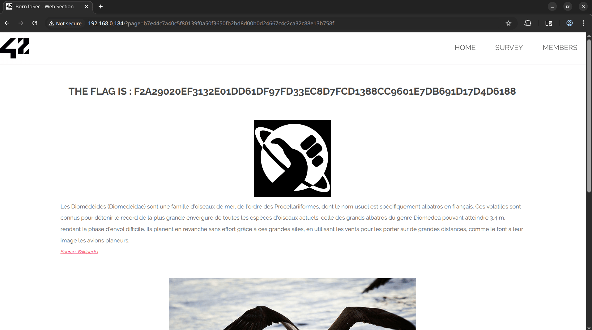

# Burp Suite - Header Manipulation Guide

## Why is it dangerous ?
1. HTTP headers (Referer, User-Agent, etc.) are not proof of identity: attackers can easily forge them. Relying solely on these values is equivalent to trusting data provided by the adversary. 

2. If the server grants privileges or secrets based solely on these headers, an attacker can obtain them without actual authentication (flag capture, sensitive data, restricted actions). This is therefore an access/authorization failure. 

## Prerequisite:

When you click on the copyright icon, it redirects you to the following URL:

http://DarklyIPaddress/?page=b7e44c7a40c5f80139f0a50f3650fb2bd8d00b0d24667c4c2ca32c88e13b758f

If you inspect the html, you will see some useless information. But if you look closer, you will see two key elements:
   ```
	<!--
		You must come from : "https://www.nsa.gov/".
	-->
   ```

and

   ```
	<!--
		Let's use this browser : "ft_bornToSec". It will help you a lot.
	-->
   ```

Starting with these informations, we already have some clues.

## 1 - Launch Burp and its integrated browser

1. Open **Burp Suite**
   - Select **Temporary project in memory**
   - Click **Next**
   - Choose **Use Burp defaults**
   - Click **Start Burp**

2. Configure the Proxy
   - Navigate to **Proxy → Intercept**
   - Make sure **Intercept is on** (the button should display "Intercept on")

3. Launch the integrated browser
   - Click **Open Browser** (button in the Proxy tab)
   - This launches the built-in browser, which is already configured to use Burp as a proxy

---

## 2 - Load the target page

1. In the built-in browser, paste the vulnerable URL:
   ```
   http://DarklyIPaddress/?page=b7e44c7a40c5f80139f0a50f3650fb2bd8d00b0d24667c4c2ca32c88e13b758f
   ```

2. Press **Enter** in the default web browser to make it load.

3. The page should load indefinitely - this is a good sign

4. In Burp Suite, the request will arrive in **Proxy → Intercept → Request** and will be blocked (intercepted)

---

## 3 - Modify the headers directly

In the **Intercepted Request** panel, you should see this:

<p align="center">
  
</p>

### Editing the request

1. Click in the text box containing the HTTP request

2. Locate the lines:
   - `User-Agent: ...`
   - `Referer: ...` (if there is no Referer already, add a line after `Host:` or after `GET ... HTTP/1.1`)

3. **Replace/add** the following headers:
   ```
   Referer: https://www.nsa.gov/
   User-Agent: ft_bornToSec
   ```

### After editing, you should have this:

<p align="center">
  
</p>

4. Click **Forward** to send the modified request to the server

---

## 4 - Result

Go back to the built-in browser, you should see this:

<p align="center">
  
</p>

---

## How to prevent it ? 

1. Never make authorization decisions based solely on headers sent by the client (Referer, User-Agent, etc.). Access controls must be performed on the server side via robust authentication and authorization (signed sessions, tokens, API keys, MFA). 

2. If you use Referer/Origin solely to reduce the risk of CSRF, combine this verification with an anti-CSRF token (double-submit or server-side token). Referer can be a supporting factor, but it does not replace the token.

3. Check all critical entries on the server side: validate sessions, check current user permissions, and deny access if the user is not authenticated/authorized.

## References:

[HTTP_Headers_Cheat_Sheet](https://cheatsheetseries.owasp.org/cheatsheets/HTTP_Headers_Cheat_Sheet.html)

[bypassing-referer-based-defenses](https://portswigger.net/web-security/csrf/bypassing-referer-based-defenses)