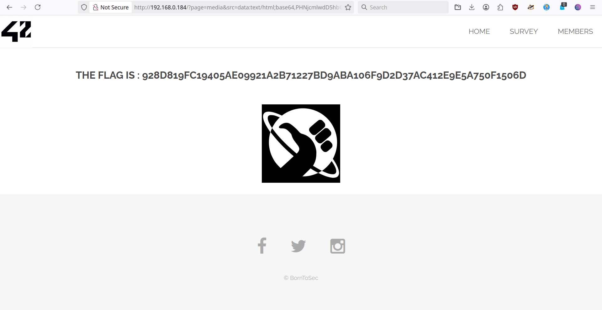

# XSS - NSA image

## Why is it dangerous ?
If the application does not properly filter what is passed to it in `src`, an attacker can inject any JavaScript code.

For example:

- **Read session cookies** (`document.cookie`) and send them to an external server

- **Modify the content of the page** (e.g., display a fake login form to steal credentials)

- **Make requests on behalf of the authenticated user** (e.g., change their password, transfer funds, etc.)

- **Load other malicious external scripts**

And all this without compromising the server: the visitor's browser does the work by executing the injected code.

## Prerequisite to get the flag:

1. When you check the homepage, you can see that the only clickable image is the NSA image.
2. Click on the image to see what happen -> It redirects you  into another page.
3. Now go back into the homepage and open the WebDev tool to check his code, to see how it is structured.

## 2 - Check if it is XSS vulnerable

1. You can see this piece of code: 
```
<a href="?page=media&src=nsa">
```
2. Modify 'src=nsa' into 'src=something_else'
3. Click on the image to see the behavior. It now goes into another page, which is not the same as previously. Meaning it is XSS vulnerable.

## 3 - Create a JS script
1. Let's create a script to inject after the src tag
```
<script>
alert('example')
</script>
```

2. We can not inject it directly with the script tags. Instead, we have to convert it into data:text. This scheme (data:) allows encoded content to be injected directly into the URL, without going through a file hosted elsewhere.
It is a roundabout way of including a script “locally,” which sometimes bypasses security filters. So let's encode or script with a [base64 encoder](https://www.base64encode.org/). We have the following string:
```
PHNjcmlwdD4KYWxlcnQoJ2V4YW1wbGUnKQo8L3NjcmlwdD4=
```

## 4 - Inject the malicious code
1. To inject our code, we previsouly have to explain the browser what kind of text it is:
```
data:text/html;base64,
```
2. Then we can replace the whole reference in the `<a>` tag by:
```
?page=media&src=data:text/html;base64,PHNjcmlwdD4KYWxlcnQoJ2V4YW1wbGUnKQo8L3NjcmlwdD4=
```

## 5 - Result

Click on the NSA image, you should be redirected into the flag page:

<p align="center">
  
</p>

---

## How to prevent it ? 

1. 

## References:

